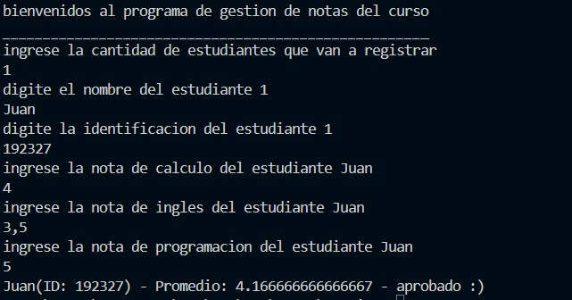

<h1>:coffee:Trabajo de programacion</h1>

Este trabajo se realizará en el lenguaje de programación Java, bajo el contexto de un encargo de un programa académico para desarrollar un software que registre a los estudiantes de un curso con su nombre y documento. El programa permitirá ingresar tres notas, calcular el promedio y mostrar el estado del estudiante (aprobado o suspendido).

<h2>
	:top:Funcionalidades
</h2>
<ul>
	<li>permite una facil recoleccion de datos</li>
	<li>permite a los estudiantes saber su promedio</li>
	<li>permite a los estudiantes saber su estado</li>
	<li>es un programa muy intuitivo y practico</li>
</ul>
<h2>
herramientas utilizadas
</h2>

<h2>
	funciones
</h2>

<h2>
autores
</h2>
<ul>
	<li>Nicoll Sofia Arevalo Caballero - 192316</li>
	<li>Juan Jose Zambrano Manzano - 192327</li>
</ul>
